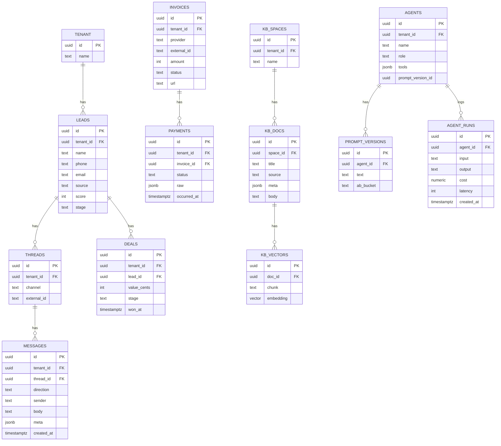

# Tridium – README de Arquitetura, API e Entrega (v1.0)

> **Contexto**: 90% do front (Next.js + estética iOS-Liquid) já feito. Falta **RAG**, **checkout no fluxo certo** (Asaas) e **plataforma back‑end** (**Gateway API + Workers + Conectores + Agentes Agno + Dados + Observabilidade**). Este README é um guia de execução e referência para devs.

---

## 1) Visão geral

**Proposta**: SaaS que atrai, engaja e converte usando a tríade de agentes:

- **Luddy** (SDR 24/7): inbox multicanal, qualifica lead, consulta CRM, envia links/checkout, fecha deal.
- **Lucy** (Tráfego/Ads Ops): cria/gerencia campanhas, otimiza orçamento, monitora métricas e alimenta KPIs.
- **Clio** (Criativa/Copy/Persona): gera criativos (vídeo, foto, carrossel), variações A/B, mensagens e ângulos por público.

**RAG** é uma **capabilidade compartilhada** (brand book, FAQs, ofertas, cases) acessível a Clio (contexto de marca/copy) e Luddy (respostas de atendimento). Lucy consome métricas e eventos — não usa RAG diretamente.

---

## 2) Arquitetura de produção

```
apps/web (Next.js App Router) ──▶ Gateway (Route Handlers / REST tipado)
                                   │ valida auth/tenant, idempotência, rate-limit
                                   ├─▶ publica eventos (Redis)
                                   ├─▶ chama Conectores (FastAPI) p/ provedores
                                   └─▶ expõe SSE para streaming de agentes

Workers (BullMQ): ingestão RAG, conciliação de pagamentos, automations/NPS

Conectores (FastAPI Python): Asaas, SDKs Ads (Meta/Google/TikTok), e-mails
(Webhooks externos entram pelo Gateway)

Banco: Supabase Postgres (RLS on) + pgvector
Storage: Supabase Storage (políticas por tenant e pasta)
Bus/Cache: Redis (fila + cache semântico)

Agentes: serviço Agno (Python) orquestra Clio/Lucy/Luddy, consome fila de eventos
Observabilidade: OpenTelemetry (traces/logs/métricas) + alertas
```

**Pagamentos**: Asaas v3 (criamos *payment* no Asaas; internamente chamamos de **intent**). Webhooks normalizados → conciliação idempotente → eventos `payment.succeeded|updated`.

---

## 3) Contrato de API (Gateway – REST tipado)

**Padrão**: `ts-rest` + `zod` com **contrato compartilhado** (client/server). Todas as rotas **exigem**:

- `Authorization: Bearer <jwt>`
- `X-Tenant-Id: <tenantId>` (fallback por subdomínio)
- `Idempotency-Key` em POST críticos (pagamento, lead, upload)

### Core

- `GET /health` → `{ ok, ts }`
- `GET /me` → perfil + roles + feature flags

### RAG (Knowledge)

- `POST /rag/spaces` → `{ id, name }`
- `POST /rag/docs` (JSON) → `{ id }`
- `POST /rag/uploads` (multipart) → `{ uploadId }` (Worker extrai/chunka/embeda)
- `POST /rag/build` → `{ jobId }` (força reprocessamento)
- `GET  /rag/search?q&k=8` → `[{ docId, chunk, score, source }]`

### Agentes (Agno)

- `POST /agents/triad` → cria/atualiza **Clio/Lucy/Luddy** (tools, guardrails, prompts)
- `POST /agents/run` → `{ agent: 'clio'|'lucy'|'luddy', input, context }` → **SSE**
- `POST /agents/tools/:toolName/invoke` → execução síncrona de tool

### CRM / Leads / Inbox (Luddy + Lucy)

- `GET|POST /leads`
- `GET|POST /threads` · `GET|POST /messages?channel=whatsapp|instagram|email|chat`
- `POST /deals/:id/win` → publica `deal.won`

### Pagamentos (Luddy)

- `POST /payments/asaas/intent` `{ amount, method: 'pix|boleto|card', meta }` → `{ intentId, invoiceUrl? }`
- `POST /payments/asaas/confirm` (cartão) → `{ status, receiptUrl? }`
- `POST /webhooks/asaas` (Gateway) → normaliza `PAYMENT_*` → publica `payment.succeeded|updated`

### Admin/Dev

- `POST /admin/integrations/asaas/webhook` (provisiona webhook)
- `POST /admin/rls/test` (smoke multi-tenant)
- `GET  /metrics/kpi?from&to` (KPIs agregados)

> **Observação**: `agents/run` usa **SSE** (text/event-stream) para streaming de respostas.

---

## 4) Modelo de dados (Delta sobre o que já existe)

### RAG

- `kb_spaces(id, tenant_id, name)`
- `kb_docs(id, space_id, title, body, source, meta)`
- `kb_uploads(id, tenant_id, path, status: queued|parsed|embedded, mime, bytes)`
- `kb_vectors(id, doc_id, chunk, embedding vector(1536))`
  - Índices: começar **sem índice**; ativar **IVFFlat** quando `kb_vectors > ~50k` e considerar **HNSW** em volumes/latências maiores (ver §7).

### Agentes

- `agents(id, tenant_id, name, role, tools jsonb, prompt_version_id)`
- `prompt_versions(id, agent_id, text, ab_bucket)`
- `agent_runs(id, agent_id, input, output, cost, latency, created_at)`

### CRM / Inbox

- `leads(id, tenant_id, name, phone, email, source, score, stage)`
- `threads(id, tenant_id, channel, external_id)`
- `messages(id, tenant_id, thread_id, direction, sender, body, meta, created_at)`
- `deals(id, tenant_id, lead_id, value_cents, stage, won_at)`

### Pagamentos (Asaas)

- `invoices(id, tenant_id, provider='asaas', external_id, amount, status, url)`
- `payments(id, tenant_id, invoice_id, status, raw jsonb, occurred_at)`
- `asaas_events(id bigserial pk, event_id text unique, payload jsonb, processed_at)`

### Observabilidade/Eventos

- `event_log(id, tenant_id, type, payload, created_at)`
- `audit_logs(...)`, `error_logs(...)`

---

## 5) Segurança multi-tenant (RLS) e Storage

### RLS em tabelas sensíveis

Política base (quando o Gateway usa service role e define GUC por request):

```sql
-- Em cada request, o Gateway faz: SET LOCAL app.tenant_id = '<TENANT>';
-- Política exemplo
create policy tenant_isolation on public.leads
for all using (tenant_id = current_setting('app.tenant_id', true)::uuid)
with check (tenant_id = current_setting('app.tenant_id', true)::uuid);
```

**Alternativa** (quando o acesso vem do browser): guardar `tenant_id` no **JWT** e referenciar via `auth.jwt() ->> 'tenant_id'` nas políticas.

### Storage (Supabase)

- Buckets **privados**. Políticas por **bucket** e **pasta** (`storage.foldername(name)`), amarrando ao `tenant_id` na raiz do path.

```sql
create policy "tenant_uploads" on storage.objects
for insert to authenticated
with check (
  bucket_id = 'kb' and (storage.foldername(name))[1] = current_setting('app.tenant_id', true)
);
```

---

## 6) Pipeline RAG (E2E)

1. **Upload** (`/rag/uploads`) → grava no Storage e `kb_uploads(status='queued')`.
2. **Worker**: detecta MIME; PDF → OCR/parse; HTML/DOC → parse → limpeza → (opcional) mascarar PII.
3. **Chunking** \~700–1200 tokens (overlap \~100) → **embedding** → `kb_vectors`.
4. **Indexação**: sem índice inicialmente; quando crescer, ativar **IVFFlat** (lists ajustado) ou **HNSW** (melhor recall com mais RAM/tempo de build).
5. **Busca**: `ORDER BY embedding <=> query LIMIT k` (cosine). Ajustar parâmetros do índice para **latência vs. recall**.
6. **Uso**: Clio/Luddy chamam `/rag/search`, retornam com **atribuição de fontes** e persistem em `agent_runs`.

---

## 7) Vetores — parâmetros práticos

- **IVFFlat**: criar com `lists = 100..10k` conforme volume; ajustar `` (p.ex. 1→32) para subir **recall** com custo de latência.
- **HNSW**: melhor recall/latência em consulta; exige mais **RAM** e tempo de build. Ajustar `hnsw.ef_search` (≥ seu `LIMIT`), e considerar `maintenance_work_mem` alto para builds.
- **Operadores**: `vector_cosine_ops` para cosine.

> Regra de bolso: comece com **IVFFlat** (lists moderado) e `probes` baixo; suba listas/probes até atingir P95 desejado. Se o corpus crescer muito ou recall ficar insuficiente, migre para **HNSW** e calibre `ef_search`.

---

## 8) Pagamentos (Asaas) – fluxo real

- **Criar cobrança**: `POST /v3/payments` com `billingType = PIX|BOLETO|CREDIT_CARD`.
- **Pix dinâmico**: recuperar QRCode/`payload` por cobrança quando necessário.
- **Cartão**: ou envia dados no create, ou tokeniza e usa `payWithCreditCard`.
- **Webhook** (Gateway): recebe `PAYMENT_*`, valida secret/IPs, responde `200` **após** persistir o evento (idempotente em `asaas_events.event_id unique`).
- **Conciliação** (Worker): atualiza `invoices/payments` e publica `payment.succeeded` (usado por Lucy para NPS/upsell e por Luddy p/ follow‑up/ganho).

**Sequências típicas**:

- Pix no prazo: `PAYMENT_CREATED → PAYMENT_RECEIVED`
- Boleto no prazo: `PAYMENT_CREATED → PAYMENT_CONFIRMED → PAYMENT_RECEIVED`
- Cartão aprovado: `PAYMENT_CREATED → PAYMENT_CONFIRMED → PAYMENT_RECEIVED (D+30)`

---

## 9) Observabilidade & SLO

- **OTel** em Gateway/Workers/Conectores (traces + spans externos).
- **Alertas** (exemplos):
  - taxa de erro ≥ 2% por 5min
  - P95 API > 500ms
  - fila > 3min
  - webhooks com retry alto
  - consulta RAG P95 > 400ms (k=6, corpus pequeno)
- **Reprodução** de conversas com PII‑mask (LGPD) para auditoria.

---

## 10) Idempotência, rate‑limit e cache

- **Idempotency-Key** obrigatório nos POSTs críticos do Gateway.
- **Webhooks**: persistir `event_id` único em `asaas_events` → processar assíncrono (retries safe).
- **BullMQ**: aplicar `limiter` por fila/grupo.
- **Rate‑limit** do Gateway: 60 req/min por IP público + por token nas rotas autenticadas.
- **Cache** Redis p/ respostas estáveis (24h) e cache semântico (RAG) quando fizer sentido.

---

## 11) Plano de entrega (4 sprints)

**S1 — Fundacional (infra + contratos)**

- Supabase (RLS on) + pgvector; buckets e políticas de Storage
- Gateway: `/health`, `/me`, `/leads`, `/payments/asaas/intent`
- Conector FastAPI (create payment) e Webhook Asaas (+ provisionador) **Aceite**: Pix sandbox → webhook → `payment.succeeded` → `deal.won`

**S2 — RAG E2E**

- Upload + Worker (parse/chunk/embed) + busca
- Clio/Luddy consumindo `/rag/search`; registrar `agent_runs` **Aceite**: resposta com **fontes**; P95 < 400ms (k=6, corpus pequeno)

**S3 — Tríade & automations**

- Lucy: Ads Ops (criação/edição, budget, métricas) e KPIs em `/metrics/kpi`
- Clio: approvals e versionamento de criativos (liga a deals vencedores)
- Luddy: qualificação + checkout + handoff humano **Aceite**: `deal.won` retroalimenta Lucy (pausa nurture) e Clio (marca criativo “winner”)

**S4 — Hardening**

- IVFFlat (ou HNSW) conforme volume; dunning Asaas; E2E Playwright (onboarding→checkout→webhook→KPIs) **Aceite**: 0 regressões; dashboards estáveis

---

## 12) Checklist de Go‑Live

-

---

## 13) Riscos & antídotos

- **RAG cresce → latência** → IVFFlat/HNSW + cache semântico; limitar `k` e tamanho do chunk
- **Webhook duplicado/perdido** → idempotência por `event_id` + reconciliador diário (pull por período)
- **Cross‑tenant** → RLS + testes negativos automatizados + contratos e2e
- **SSE em edge** → fallback para polling/websocket quando ambiente não suportar SSE

---

## 14) Próximo passo imediato

1. Subir **contrato **`` (schemas + stubs) para: `/rag/*`, `/agents/*`, `/leads`, `/payments/*`.
2. Rodar **migrations** (RAG/CRM/Asaas events) e **workers** (ingest/conciliação).
3. Conectar o front iOS‑Liquid: **formulário RAG** (upload + progresso), **checkout Pix** (sandbox), e **inbox** do Luddy.

---

## 15) Apêndice – exemplos úteis

### Ex. índice IVFFlat (cosine)

```sql
create index on kb_vectors using ivfflat (embedding vector_cosine_ops) with (lists = 100);
-- consulta
set ivfflat.probes = 8;
select doc_id, chunk from kb_vectors order by embedding <=> :q limit 6;
```

### Ex. índice HNSW (cosine)

```sql
create index on kb_vectors using hnsw (embedding vector_cosine_ops);
-- consulta
set hnsw.ef_search = 80; -- >= LIMIT
```

### Ex. SSE no Gateway (pseudo)

```ts
export async function GET() {
  const encoder = new TextEncoder();
  const stream = new ReadableStream({
    start(controller) {
      controller.enqueue(encoder.encode('data: hello\n\n'));
      // ...push tokens do agente
    }
  });
  return new Response(stream, { headers: { 'Content-Type': 'text/event-stream' } });
}
```

### Ex. idempotência de webhook (SQL)

```sql
create table asaas_events (
  id bigserial primary key,
  event_id text unique not null,
  payload jsonb not null,
  processed_at timestamptz
);
```

### Env vars (mínimo)

```
SUPABASE_URL, SUPABASE_SERVICE_ROLE_KEY
REDIS_URL
ASAAS_ACCESS_TOKEN, ASAAS_WEBHOOK_SECRET, ASAAS_BASE_URL
OPENAI_API_KEY (ou provedor equivalente)
AGNO_ENV={prod|dev}
```

---

## 16) Diagramas (Mermaid)

> Visualizações para acelerar o entendimento do time. Copie/cole em viewers Mermaid quando necessário.

### 16.1 Arquitetura (visão macro)


### 16.2 Tríade de agentes e contexto


### 16.3 Fluxo de pagamento (sequência Asaas)


### 16.4 Pipeline RAG (E2E)


### 16.5 RLS multi-tenant (conceito)


### 16.6 ERD essencial (dados principais)



---

**Fim – v1.0**

